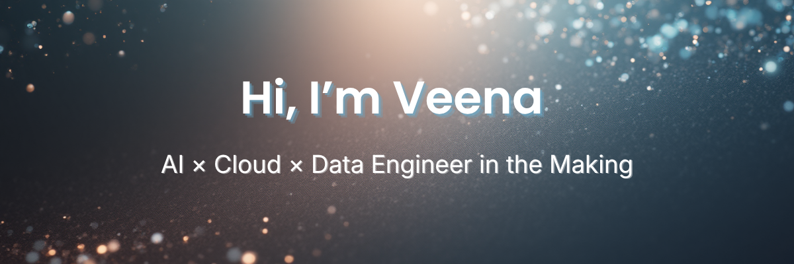

  

  

  

**Building the bridge between ideas and deployable intelligence.**  
 
📍 Dallas, TX  
🌐 [LinkedIn](https://www.linkedin.com/in/veenakvenugopal/) · 🧠 [Portfolio](https://veena-dev.netlify.app/) · 🧩 [LeetCode](https://leetcode.com/u/VeenaKV/)  

---

## 💡 About Me  

I’m a data-driven problem solver with ~4 years of **IT support + data** experience, now transitioning into **AI/ML, Cloud, and Data Engineering**.

Right now I’m in a **“build and ship” season**:
- Turning real-world problems (healthcare, liquor retail, receipts, cost optimization) into projects  
- Deploying things to the cloud instead of keeping them as “local only” ideas  
- Using hackathons as deadlines to learn faster and ship cleaner  

If you like **practical AI, thoughtful APIs, and clean data workflows**, we’ll get along well. 🙂

---

## 🚧 Featured Projects
These are projects you can actually click, run, or see in action:

### 🔍 InsightLens – Chrome Built-in AI Challenge 2025  
**Repo:** [insight-lens](https://github.com/Veena-K-Venugopal/insight-lens)  
A lightweight web app that turns messy receipts, invoices, or order emails into **5-bullet action briefs** using Chrome’s built-in AI APIs.  
- Accessible UI with status messages and validation  
- Multiple output modes: summary, brief, proofreading  
- Built to respect privacy: works entirely in the browser  

> Focus: **Frontend, UX, prompt design, browser AI**

---

### Healthcare API Enhancer (Flagship Backend)  
**Repo:** [healthcare-api](https://github.com/Veena-K-Venugopal/healthcare-api)  
FastAPI-based backend for **patient records + ML-style predictions**, designed as a starter for a full MLOps pipeline.  
- Modular FastAPI app structure  
- `/predict` endpoint wired to a mock model (real model integration in progress)  
- Deployed to Render for easy demo & testing  

> Focus: **APIs, backend design, ML-in-the-loop**

---

### Ops Whisperer – Cloud Run Edition  
**Repo:** [ops-whisperer-google-cloud](https://github.com/Veena-K-Venugopal/ops-whisperer-google-cloud)  
An AI-powered **operations assistant** for liquor retail, built for a Google Cloud / Cloud Run hackathon.  
- Designed to ingest store ops data (orders, stock, promos)  
- Uses **Gemini** + serverless infra (Cloud Run)  
- Goal: answer “what should I order / price / promote next?” in natural language  

> Focus: **Cloud, serverless, domain-specific AI for retail**

---

### Developer Portfolio  
**Repo:** [veena-portfolio](https://github.com/Veena-K-Venugopal/veena-portfolio)  
**Live:** https://veena-dev.netlify.app/  

A clean, responsive portfolio built with **React + Tailwind + Vite**.  
- Highlights my projects, stack, and ongoing learning  
- Designed to be easy to update as my projects grow  

> Focus: **Frontend, personal branding, deployment**

---

### SQL Practice for Data Interviews  
**Repo:** [sql-practice](https://github.com/Veena-K-Venugopal/sql-practice)  

A growing collection of **SQL interview-style problems** (DataLemur, LeetCode, etc.), with:  
- Organized folders by source/problem  
- Clear, commented solutions  
- Focus on readability + reasoning, not just “it runs”  

> Focus: **Analytics, query design, interview prep**

---

## 🧩 In-Progress & Upcoming Builds

These are part of my “Super Cool Projects” roadmap – some have code, some are still in the design/early implementation stage.

### Real-Time Pricing Dashboard (Liquor Retail)  
End-to-end **pricing analytics** system for a liquor store use case:  
- Python ETL → PostgreSQL or Redshift-style warehouse  
- Scheduled ingestion of price / promo / sales data  
- React or Streamlit dashboard for trends & recommendations  

**Status:** Data model + pipeline design in progress; implementation planned as my next major data/ETL project.

---

### GPT Agent Orchestration (MCP-Enabled)  
Multi-agent workflow for **resume & document analysis**:  
- Uses vector search & tools (MCP-style)  
- One agent to extract structure, one to analyze, one to suggest improvements  
- Designed to be infrastructure-ready for future integration with APIs  

**Status:** Architecture drafted; implementation in early planning.

---

### AWS Cloud Cost Optimizer  
Serverless tool for **tracking and alerting on AWS costs**:  
- Lambda functions to pull AWS usage/costs  
- DynamoDB/S3 for storage  
- SNS or email alerts for anomalies or threshold breaches  

**Status:** MVP spec drafted; coding planned as part of AWS cost/ops learning.

---

### LLM Data & Pretraining Tools (Concept Suite)  
A set of small, focused utilities for working with **pretraining / fine-tuning data**:  
- Data cleaning + deduplication pipelines  
- Simple token frequency visualizer for spotting weird distributions  
- Tiny “training log explorer” to visualize overfitting / loss curves  

**Status:** Ideas + notes stage; will likely evolve into one or two focused repos.

---

## Practice & Learning Repos

I treat GitHub as a learning log, not just a gallery. Some repos are intentionally **practice playgrounds**:

- **Frontend Mentor Challenges** – multiple `fm-*` repos with HTML/CSS/JS practice  
- **freecodecamp-certifications** – projects completed while studying web fundamentals  
- Math & tutoring materials – small bits of code and worksheets used while helping my niece prep for Swedish national math exams  

They’re not “perfect”, but they show how I practice, refactor, and grow.

---

## ⚙️ Tech Stack

**Core Languages**  

  
  
  
  
  

  

**Data & ML**  

  
  
  
  

Exploring vector search, embeddings, and retrieval workflows.

  

**Backend & APIs**  

  
  
  
  

RESTful APIs, input validation, and schema design.

  

**Frontend & UI**  

  
  
  
  
  

Responsive, accessible layouts and clean component structure.

  

**Cloud & Infra**  

  
  
  
  

AWS (S3, Lambda, IAM) · Google Cloud Run · Render · Netlify

  

**Data & Analytics**  

  
  
  
  

Streamlit dashboards · Data exploration · Reporting

  

**Tools & Workflow**  

  
  
  
  
  

Git branching · PRs · tagging · release management  
Markdown documentation · Devpost-style storytelling

---

### 📊 GitHub Stats

  
  

  

  

---

## 📚 Currently Learning & Working On

- **Stronger DSA in Python** (to support backend + ML work)  
- **AWS certifications** (Cloud Practitioner first, AI/ML later)  
- **LLM workflows**: prompt design, retrieval, basic agent patterns  
- **End-to-end data projects**: from raw CSV → cleaned DB table → deployed dashboard

---

📬 **Reach me:** `vkvenu10@gmail.com`  

If you’re interested in AI/ML, data, or cloud — or you want to chat about building real projects from messy real-world problems — my inbox is open. 🤝
