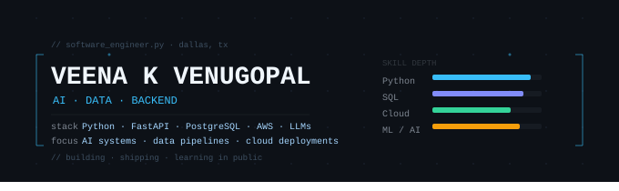

  

  

  

**Software engineer with a data and ops foundation — building AI/ML systems, data pipelines, and backend APIs that solve real business problems.**

 

📍 Dallas, TX  
🌐 [LinkedIn](https://www.linkedin.com/in/veenakvenugopal/) · 🧠 [Portfolio](https://veena-dev.netlify.app/) · 🧩 [LeetCode](https://leetcode.com/u/VeenaKV/)  

---

## About Me  

I'm a software engineer with a BS in Computer Science and ~4 years of experience in IT operations and data workflows across retail and healthcare environments. That background gives me something most engineers don't have: I've seen firsthand where systems break, where data goes wrong, and where AI can actually change outcomes — not just on paper.
Right now I'm focused on building and shipping end-to-end systems at the intersection of **AI, data engineering, and backend development** — deploying to the cloud, integrating LLMs into real workflows, and treating every project as production-grade from day one.

---

## 🚧 Active Projects

### Ops Whisperer – AI Operations Assistant for Retail
**Repo:** [ops-whisperer-google-cloud](https://github.com/Veena-K-Venugopal/ops-whisperer-google-cloud)
 
An AI-powered operations assistant for liquor retail built on **Google Cloud Run + Gemini**. Designed to answer natural language questions about store ops data — inventory, pricing, promotions — without requiring a data analyst in the loop.
 
- Serverless architecture on Cloud Run for cost-efficient scaling
- Gemini integration for domain-specific natural language querying
- Structured around real retail ops data patterns from direct industry experience
 
> Stack: **Python · Google Cloud Run · Gemini · Docker**

---

## 💡 Featured Projects

### 🔍 InsightLens – Chrome Built-in AI Challenge 2025
**Repo:** [insight-lens](https://github.com/Veena-K-Venugopal/insight-lens)
 
A privacy-first browser tool that converts receipts, invoices, and order emails into structured 5-bullet action briefs — entirely client-side using Chrome's built-in AI APIs. No data leaves the browser.
 
- Multiple output modes: summary, action brief, proofreading
- Accessible UI with validation and status feedback
- Submitted to the Chrome Built-in AI Challenge 2025
 
> Stack: **JavaScript · Chrome AI APIs · HTML/CSS**

---

### Healthcare API Enhancer
**Repo:** [healthcare-api](https://github.com/Veena-K-Venugopal/healthcare-api)
 
A modular FastAPI backend for patient record management with an ML prediction endpoint — structured as a production-ready foundation for an MLOps pipeline.
 
- `/predict` endpoint wired for model integration
- Clean separation of concerns across routes, schemas, and services
- Deployed on Render for live demo access
 
> Stack: **Python · FastAPI · PostgreSQL · Render**

---

### Developer Portfolio  
**Repo:** [veena-portfolio](https://github.com/Veena-K-Venugopal/veena-portfolio)  
**Live:** https://veena-dev.netlify.app/  

Responsive personal portfolio built with React, Tailwind, and Vite. Designed to be lightweight, fast, and easy to keep current as projects evolve.
 
> Stack: **React · Tailwind CSS · Vite · Netlify**

---

### SQL Practice for Data Interviews  
**Repo:** [sql-practice](https://github.com/Veena-K-Venugopal/sql-practice)  

Structured collection of SQL problems from DataLemur and LeetCode, organized by source with commented solutions focused on readability and analytical reasoning — not just passing tests.
 
> Focus: **Window functions · CTEs · query optimization · analytical thinking**

---

## ⚙️ Tech Stack

**Languages**
Python · SQL · JavaScript · Java · C · C++
 
**AI / ML**
LLMs (Claude API, Gemini) · scikit-learn · Pandas · NumPy · MLflow · Hugging Face · Vector Search · Embeddings
 
**Backend & APIs**
FastAPI · Node.js · Express · REST · PostgreSQL · SQLite
 
**Frontend**
React · Vite · Tailwind CSS · HTML5 · CSS3
 
**Cloud & Infra**
AWS (S3, Lambda, IAM) · Google Cloud Run · Docker · Linux · Render · Netlify
 
**Tools**
Git · GitHub · VS Code · Jupyter · Streamlit

---

### 📊 GitHub Stats

  
  

  

  

---

📬 **Let's connect:** `vkvenu10@gmail.com`  

I'm interested in roles at the intersection of AI, data, and backend engineering — especially teams building systems where the data and the model both have to work in the real world. Open to conversations.
